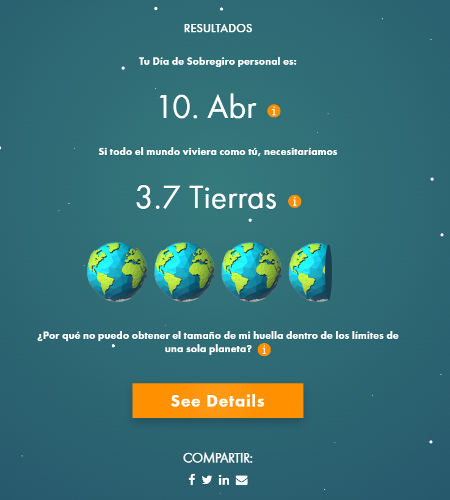
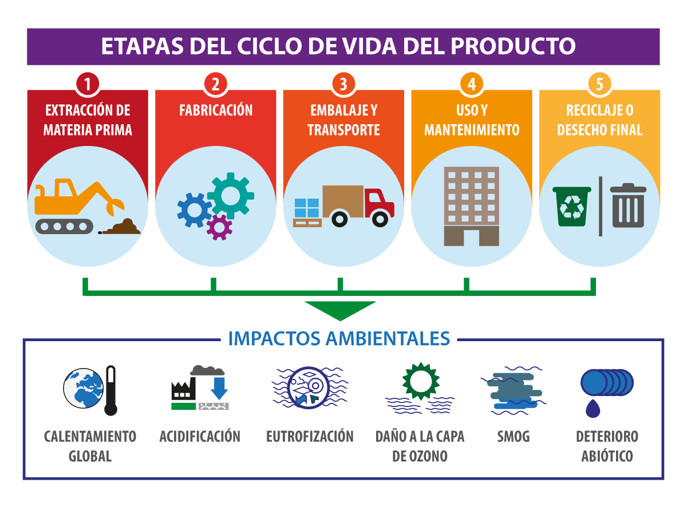

# Diciembre
>## **Día 12 (5/12/2025)**

¿Cuanto pesas en el planeta?

Huella ecológica y huella de carbono

Huella ecológica:
Demanda vs oferta (Compara la cantidad que consumimos contra lo que la tierra puede asimilar)

Huella de carbono:
Identificador de feuntes de Co2 en el medio ambiente (actividad, producto, individuo o empresa) estableciendo estrategias para reducirlo

Estrategias para reducción:
1. Reducir
2. Eficiencia
3. Compensar

¿Cuál es tu huella de carbono?

---

# Noviembre

>## **Día 11 (27/11/2025)**

Economía lineal VS Circular

Economñia Lineal: Tomar, hacer y desechar

Economía Circular: Reutilizar esos desechos para la creación de nuevos materiales

    - Ecodiseño
    - Prioridad
    - Integración ecosistémic   a

>**¿Cómo me afecta el sistema de ecodiseño? ¿Problemas personales/colectivos?**

Gracias a la implementación de un Ecodiseño en nuestro día a día se pueden ver distintos casos en los que esto se vería factible y por otro lado las cosas podrían tornarse peor si no se tiene un buen uso de éste sistema.

El lado positivo está claramanete en el efecto positivo que tiene ésto en el medio ambiente ya que todo los desechos se verían en un estado reciclabe y viable para poder reutilizar este "desecho" y evitar la contaminación mundial en el mundo.

Sin embargo, esto llevaría a una implementación de nuevas costumbres y diferentes procesos de producción de productos en donde las costumbres llevarían a la confusión de los clientes concurrentes en las empresas.
Esto resultaría en que pocas empresas no tomarían este sistema como implementación por el miedo a perder sus ingresos o bajar significativamente éstos u otras empresa podrían decir que implementan estos materiales reciclables y simplemente no usarlos, solamente para fomentar una buena imágen a la empresa.

>## **Día 10 (21/11/2025)**

No hubo clase

>## **Día 9 (14/11/2025)**

Se añadirá a partir de hoy una imágen en el repositorio para cada clase

Se ha explicado el peso oculto detrás de la fabricación y sostención de por ejemplo un teléfono, en donde la fabricación de un teléfono, los materiales que se usan para la fabricación de uno solo puede llegar a tener un peso de aproximadamente 80kg de materiales solo para la fabricación de un teléfono de 150g.

Análisis del ciclo de vida
1. Materias Primas: Extracción de recursos
2. Fabricación Proceso industrial
3. Distribuciones Transporte de producto
4. Uso La vida del producto con el consumidor
5. Gestión Desecho del producto al vertedero

> Investigación con la IA respecto al ciclo de vida de una tostadora:

### 1. Materias primas (Extracción de recursos)

En esta etapa se obtienen los materiales necesarios para fabricar la tostadora:

Metales como acero inoxidable (carcasa), aluminio y cobre (cables).

Plásticos como ABS o polipropileno para las partes externas e internas.

Componentes electrónicos (placa de control, interruptores, resistencias, termostatos).
Estos materiales provienen de minería, extracción de petróleo, refinado y procesos industriales de base.
Impactos típicos: consumo de recursos naturales, uso energético alto, emisiones en extracción y refinado.

 ### 2. Fabricación (Proceso industrial)

Una vez obtenidas las materias primas, se fabrican y ensamblan los componentes de la tostadora:

Moldeado de piezas plásticas.

Conformado del acero para la carcasa.

Fabricación del elemento calefactor (resistencia).

Montaje del cableado y de la electrónica.

Ensamblaje final en la planta y pruebas de calidad.
Impactos típicos: consumo energético en máquinas, generación de residuos de producción, emisiones asociadas a electricidad y calor industrial.

 ### 3. Distribución (Transporte del producto)

La tostadora terminada se transporta desde la fábrica hasta centros logísticos, tiendas o directamente al consumidor.

Puede involucrar transporte por barco, camión o avión (según país de fabricación).

Incluye embalajes secundarios (cajas, cartón, plásticos).
Impactos típicos: combustión de combustibles fósiles para el transporte, emisiones de CO₂, generación de residuos de embalaje.

 ###  4. Uso (Vida del producto con el consumidor)

La tostadora se utiliza regularmente en el hogar:

Consumo de electricidad para calentar las resistencias.

Desgaste de componentes internos por ciclos térmicos.

Posibles reparaciones o mantenimiento básico (retirar migas).
Impactos típicos: consumo energético diario (puede superar la huella de fabricación si se usa durante varios años), coste económico y emisiones indirectas según el mix eléctrico del país.

### 5. Gestión del final de vida (Desecho o reciclaje)

Cuando la tostadora deja de funcionar, pasa al flujo de residuos:

Puede terminar en vertedero o incineración.

Idealmente entra a un punto limpio / RAEE, donde se recuperan metales y cables.

Los plásticos y piezas electrónicas son más difíciles de reciclar, pero parte del acero y cobre suele recuperarse.
Impactos típicos: si no se recicla, se pierden materiales valiosos y se contaminan suelos/aire; si se recicla, se reduce la necesidad de producir materiales vírgenes.

Esto daría como resultado un peso uculto de unos 40 y 90kg de material transportado por una tostadora de 1,4kg 

>## **Día 8 (7/11/2025)**

No hubo clase

---

# Octubre

>## **Día 7 (31/10/2025)**

Se ha realizado una charla sobre los recursos limitados que se tiene en el planeta tierra, mostrando como es que el agua es recolectado a nivel regional por acuíferos y pozos.
Además, como es que estos recursos serían completamente escasos y se necesitarían 5 planetas tierras si todo el mundo usara los recursos que se usan en el primer mundo.
También, se habló sobre el ciclo cerrado de la biosfera, donde se nos da a entender que al morir nuestros atómos de carbono se liberan al morir, las plantas de alimentan de éstos y nosotros comemos plantas por lo que se genera un ciclo.
Por ultimo, hemos elegido unos cuantos un método de sostenibilidad de recursos en clase para ponerlo en el repositorio grupal y discutirlo después.

>## **Día 6 (24/10/2025)**

Se ha hablado sobre los distintos métodos que tienen varios seres vivos a la hora de mantener su especie viva y evolucionando:

Estrategia K: Crecimiento poblacional lento, en donde los "padres" tienden a tener un control parental sobre éstos hijos. Además, tiende a ser una estrategia en la que se reproduce de una manera lenta pero al llegar a cierta cantidad de seres vivos en ésta especie se mantiene en una linea estable en la que va evolucionando respecto a los cambios que presenta el ambiente. 

Estrategia R: Crecimiento poblacional rápido, en donde este tipos de especies tienede a tanto como a reporducirse muy rápido y a morir muy rápido. Generando un pico cosntante en la cantiadd de seres vivos por especie.

¿Qué estrategia usamos los humanos?

Es cierto que los humanos han tenido ciertas épocas donde se vió una reporducción más alta pero no llega a ser tan exagerada como lo puede ser una especie de estrategia R, donde el parentezco se ve mucho más presente que en la estrategia K.

>## **Día 5 (17/10/2025)**

Primero, hablamos sobre la convivencia que existe entre los seres vivos y como nos relacionamos con ellos todos los días, dejando en claro que nunca estamos solos, vivimos al rededor de animales, flora y distintas personas dentro de nuestra sociedad que afectan a nuestros comportamientos diariamente.

*¿Qué hacemos nostros? ¿cooperamos o competimos?*

Yo pienso que internamente todos competimos contra algo, pero coopermos para lograr ese algo.

El animal en general tiende a comportarse y a tomar decisiones en base a la supervivencia de si mismo y hace lo que sea necesario para mantenerse en pie. Un ejemplo que me hizo pensarlo fue el equipo de futbol:

- Distintos equipos compiten para ganar el torneo.
- Cada equipo coopera entre ellos para ganar el partido.
- Internamente en cada equipo compiten entre ellos para ser el mejor, destacar y posiblemente ganar un balón de oro.

>## **Día 4 (10/10/2025)**

En esta clase hemos profundizado sobre varios aspectos sobre los órganismos vivos, sus comportamientos, su perseverancia y capacidad para sobrevivir.

Se ha hablado sobre la capacidad de carga que tiene un ecosistema, sus limites de existencia dentro de una sociedad y distintos ejemplos por los órganismos tienen si o sí un límite.

Uno de los ejemplos más claros fueron la disponibilidad de recursos y como mencioné anteriormente, la capacidad de carga con la que cuenta un ecosistema para almacenar distintos órganismos.

>## **Día 3 (3/10/2025)**

Hemos debatido sobre diferentes perspectivas entre los humanos y los animales, similitudes, diferencias y como es que de cierta manera somos todos animales.
Además, una pequeña vista y discusión a como la vida en la tierra va a prevalecer.

*¿Acabaremos con la vida de nuestra planeta?*

Desde un punto de vista en el que supongamos que se arma una guerra nuclear entre potencias, considero que gran parte de la vida como la conocemos en el planeta se vería afectada gravemente tanto por el daño de las bombas como el de la radiación que generaría después. La tierra se vería en un estado crítico en donde sería muy dificil recuperarse para manterner vida sostenible.

Sin embargo, es muy dificil acabar con toda la vida al 100% en el planeta, ya que habrían plantas, diferentes bacterias, organismos que prevalecerían en esas condiciones. Mi respuesta es que es muy dificl acabar con la vida completa del planeta.

# Septiembre 

>## **Día 2 (26/09/2025)**

Se han explicado los conceptos principales de la asignatura como lo es la sostenibilidad y sus 3 dimensiones fundamentales para la sostenibilidad para que funciones una sociedad y hemos dejado en claro con nuestros compañeros de fila como se realizará la actividad propuesta en clase.

>## **Día 1 (19/09/2025)**

Se ha explicado en clase los diferentes resultados de aprendizaje y la actividad grupal que se realizará a lo largo del año en la hora semanal de clase.
